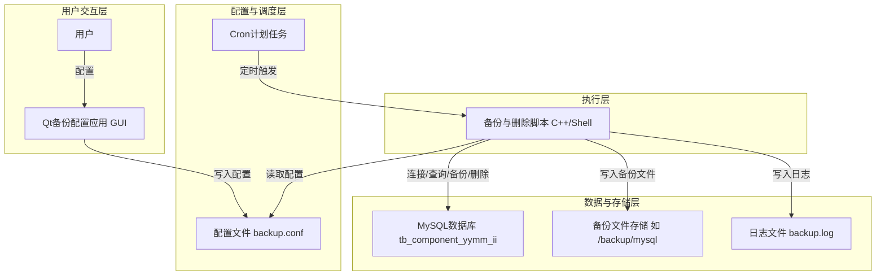
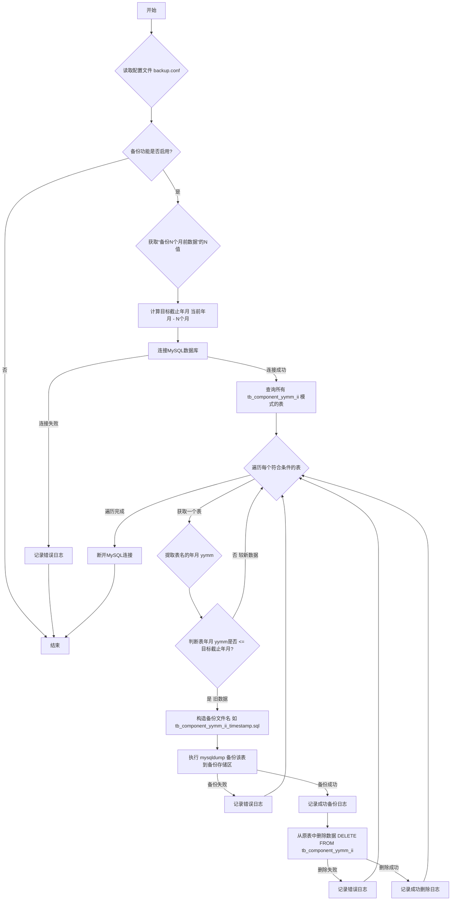
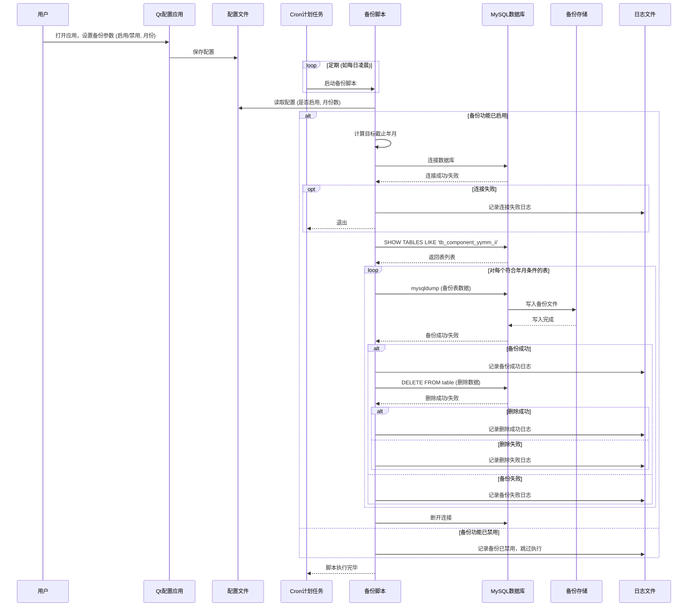

# 数据库自动备份设计

## 架构图

```mermaid
%% 1. 架构图 Architecture Diagram
graph TD
    subgraph "用户交互层"
        User[用户]
        QtApp[Qt备份配置应用 GUI]
    end

    subgraph "配置与调度层"
        Config[配置文件 backup.conf]
        Cron[Cron计划任务]
    end

    subgraph "执行层"
        BackupScript[备份与删除脚本 C++/Shell]
    end

    subgraph "数据与存储层"
        MySQL[MySQL数据库 tb_component_yymm_ii]
        BackupStorage[备份文件存储 如 /backup/mysql]
        LogFile[日志文件 backup.log]
    end

    User -- 配置 --> QtApp
    QtApp -- 写入配置 --> Config
    Cron -- 定时触发 --> BackupScript
    BackupScript -- 读取配置 --> Config
    BackupScript -- 连接/查询/备份/删除 --> MySQL
    BackupScript -- 写入备份文件 --> BackupStorage
    BackupScript -- 写入日志 --> LogFile
```

## 流程图

```mermaid
%% 2. 流程图 Backup Script Flowchart
graph TD
    A[开始] --> B{读取配置文件 backup.conf};
    B --> C{备份功能是否启用?};
    C -- 否 --> Z[结束];
    C -- 是 --> D{获取“备份N个月前数据”的N值};
    D --> E[计算目标截止年月 当前年月 - N个月];
    E --> F[连接MySQL数据库];
    F -- 连接失败 --> G[记录错误日志];
    G --> Z;
    F -- 连接成功 --> H[查询所有 tb_component_yymm_ii 模式的表];
    H --> I{遍历每个符合条件的表};
    I -- 遍历完成 --> Y[断开MySQL连接];
    Y --> Z;
    I -- 获取一个表 --> J{提取表名的年月 yymm};
    J --> K{判断表年月 yymm是否 <= 目标截止年月?};
    K -- 否 较新数据 --> I;
    K -- 是 旧数据 --> L[构造备份文件名 如 tb_component_yymm_ii_timestamp.sql];
    L --> M[执行 mysqldump 备份该表到备份存储区];
    M -- 备份失败 --> N[记录错误日志];
    N --> I;
    M -- 备份成功 --> O[记录成功备份日志];
    O --> P[从原表中删除数据 DELETE FROM tb_component_yymm_ii];
    P -- 删除失败 --> Q[记录错误日志];
    Q --> I;
    P -- 删除成功 --> R[记录成功删除日志];
    R --> I;
```

## 时序图

```mermaid
sequenceDiagram
    participant User as 用户
    participant QtApp as Qt配置应用
    participant ConfigFile as 配置文件
    participant Cron as Cron计划任务
    participant BackupScript as 备份脚本
    participant MySQL as MySQL数据库
    participant BackupStorage as 备份存储
    participant Log as 日志文件

    User ->> QtApp: 打开应用，设置备份参数 (启用/禁用, 月份)
    QtApp ->> ConfigFile: 保存配置

    loop 定期 (如每日凌晨)
        Cron ->> BackupScript: 启动备份脚本
    end

    BackupScript ->> ConfigFile: 读取配置 (是否启用, 月份数)
    alt 备份功能已启用
        BackupScript ->> BackupScript: 计算目标截止年月
        BackupScript ->> MySQL: 连接数据库
        MySQL -->> BackupScript: 连接成功/失败
        opt 连接失败
            BackupScript ->> Log: 记录连接失败日志
            BackupScript -->> Cron: 退出
        end

        BackupScript ->> MySQL: SHOW TABLES LIKE 'tb_component_yymm_ii'
        MySQL -->> BackupScript: 返回表列表

        loop 对每个符合年月条件的表
            BackupScript ->> MySQL: mysqldump (备份表数据)
            MySQL ->> BackupStorage: 写入备份文件
            BackupStorage -->> MySQL: 写入完成
            MySQL -->> BackupScript: 备份成功/失败

            alt 备份成功
                BackupScript ->> Log: 记录备份成功日志
                BackupScript ->> MySQL: DELETE FROM table (删除数据)
                MySQL -->> BackupScript: 删除成功/失败

                alt 删除成功
                    BackupScript ->> Log: 记录删除成功日志
                else 删除失败
                    BackupScript ->> Log: 记录删除失败日志
                end
            else 备份失败
                BackupScript ->> Log: 记录备份失败日志
            end
        end

        BackupScript ->> MySQL: 断开连接
    else 备份功能已禁用
        BackupScript ->> Log: 记录备份已禁用，跳过执行
    end

    BackupScript -->> Cron: 脚本执行完毕
```
