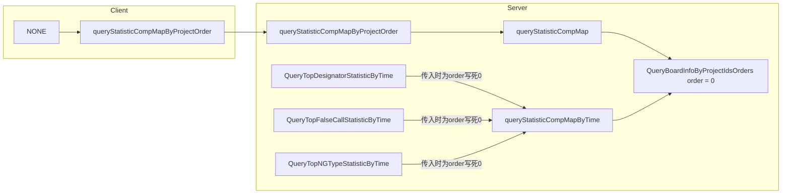

# 开启料号时统计无法查询

```mermaid
graph LR

	subgraph Server
        A[QueryBoardInfoByProjectIdsOrders order = 0]
        B[queryStatisticCompMap]-->A
        C[queryStatisticCompMapByTime] --> A
        D[QueryTopDesignatorStatisticByTime ] --传入时为order写死0-->C
        E[QueryTopFalseCallStatisticByTime ] --传入时为order写死0-->C
        F[QueryTopNGTypeStatisticByTime ] --传入时为order写死0-->C
        G[queryStatisticCompMapByProjectOrder ] -->B
	end
	subgraph Client
        H[queryStatisticCompMapByProjectOrder ] -->G
        I[NONE] -->H
	end

```
